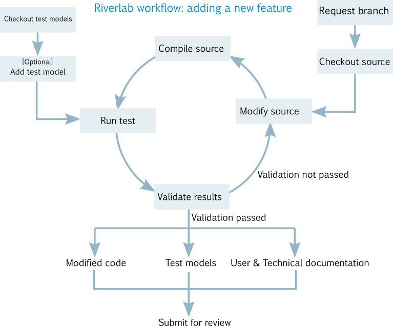
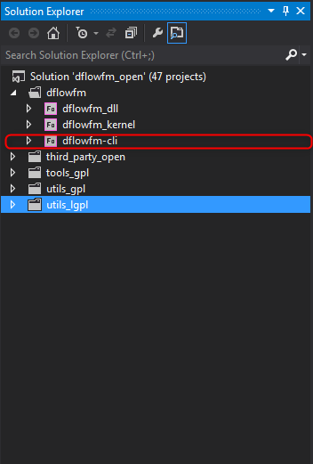
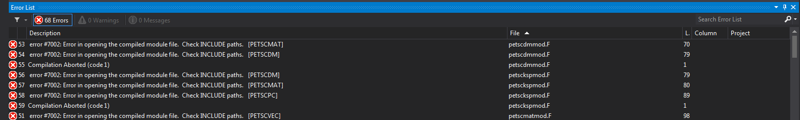
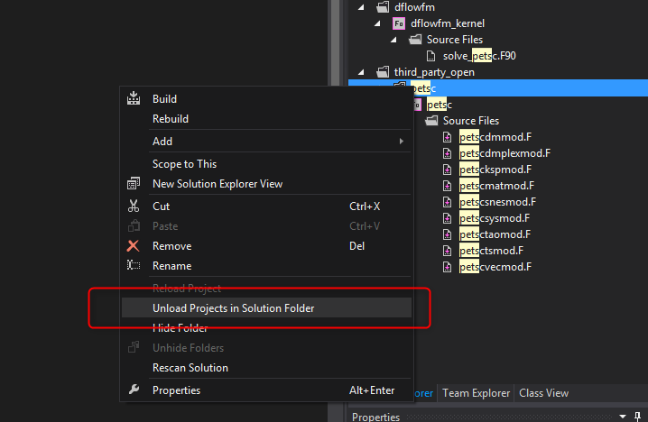

===========================
Feature development
===========================
:Authors:
    Koen D. Berends
:Version: 1.0 of 16/01/2019

In this tutorial we are going to add the roughness formula Västilä & Järvelä (2017) to the Delft3D FM source code. We will then build a model which is subsequently tested against experimental data, to test whether our implementation was done correctly. Finally, we prepare a validation document detailing both our proposed new feature and validation results, which will be submitted for review by Deltares. 
If the new feature was correctly implemented, does not break other functionality and is well validated, the new feature will be considered for implementation in the trunk (i.e., staged for release). 

Ingredients
===========================

- version control (see ...)
- Python
- Tools necessary to build & modify code (i.e. an IDE, compiler). 
- an oss.deltares.nl account (see ...)

Overview of steps and resources
===========================

First steps: preparation
===========================

Requesting a new branch of the source code
---------------------------

In this walkthrough we're going to make modification to the source code. Within the Riverlab framework, you can request a new branch in which you can safely commit your changes. If your are unfamiliar with terms like *branch* or *commit*, now is a good time to read up on the basics of (SVN) version control.

You can request a new branch by sending an email to `riverlab@deltares.nl <mailto:riverlab@deltares.nl>`_. In your email, include the following information: name of your institution and name of the project. From the project name it should be clear what you intend to modify. In our case, the institution is "Aalto University" and project is "Jarvela_vegetation". Our branch is: "https://svn.oss.deltares.nl/repos/delft3d/branches/research/Aalto University/20190111_Jarvela_vegetation". 

Important to know about this branch

 - Everyone with an oss.deltares.nl account has read-access to this branch by default. 
 - Only you will have write-access

Checkout the source code
---------------------------
Use your favourite SVN client to checkout your branch to your local machine. 

Checkout the testmodels
---------------------------
An overview of test models is available from the `Riverlab website <https://oss.deltares.nl/web/riverlab-models/models>`_. All models, including the testmodels, are under version control at the following SVN server: https://svn.oss.deltares.nl/repos/openearthmodels/trunk/riverlab/testcases/

[Optional] add a new testmodel
---------------------------
Often when you implement new functionality, existing test models will not be sufficient to validate your implementation. In such cases, you need to build a new test model. Just as with the source code, you can take advantage of version control for model development. If you followed the previous steps, you already checked out the existing riverlab testmodels to your local machine. To add a new test model, you may add a new folder and commit your files to this folder. It is important to follow the naming conventions

	``\testcases``

This is the top directory

	``\testcases\f[#]_[name]``

These folders contain testcases for specific functionality. If you add a new one, replace # with the next number in the folder (e.g. if the previous was names 'f20_openchannelflow' then yours will begin with 'f21_...'). Use a descriptive name. 

In our case, the previous testcase was [f29_mor1d2d_morfologie] and we will add functionality regarding a vegetation model. Therefore, we name add the folder [f30_aalto_vegetation_models]

	``\testcases\f[#]_[name]\c[#]_name``

These folders contain testcases. Each testcase should have at least the following data: the Delft3D FM model files (input only, no output!) and the validation document. All model files are stored in this directory

	``\testcases\f[#]_[name]\c[#]_name\doc``

This directory contains the source code (LaTeX) of the validation document. Each testcase validates a certain claim about (a newly implemented part of) the software. For example, in our case we will claim that the numerical model is able to reproduce laboratory experiments under a set of given conditions. The validation document details the purpose of this testcase, the linked claims, the test approach, model setup, results and conclusions. 

Sometimes you will have multiple testcases that are very similar, e.g. the same experimental setup but with different boundary conditions. In such cases, you may bundle your results in one validation document. In this case, include a readme.txt which includes the location of the bundled validation document. 
	

Test-driven development
===========================

Compiling the source code
---------------------------
At this point, we assume you already have the source locally from the `Checkout the source code`_. To be able to compile and modify the source code, you will need to set up a development environment. It highly depends on your operating system (Windows, Linux or macOS) and available software what is best for you. The best place to start is ``src/readme``. Other resources are the `online boards <https://oss.deltares.nl/web/delft3dfm/home/-/message_boards/category/217304/maximized>`_ and workshops during the `Delft Software Days <https://softwaredays.deltares.nl>`_. 

For this example, we will compile the Delft3D FM source (revision 62958) with `Visual Studio 2012 <https://visualstudio.microsoft.com/vs/older-downloads/>`_ and `Intel Parellel Studio XE 2013 SP 1 <https://software.intel.com/en-us/intel-parallel-studio-xe-compilers-required-microsoft-visual-studio>`_, which includes C++ and Fortran compilers on Windows 7. 
Following the README we create 'solution files' for Visual Studio by running ``src/prepare_sln.py``. Note that need Python installed (and, available in your PATH variable) to run this script. We then open 'dflowfm_open.sln' with Visual Studio.

In the solution explorer, we first change the build configuration (right click on ``solution 'dflowfm_open'`` and choose ``configuration manager``) to ``release`` and ``x64``. Next,s we are going to build ``dflowfm-cli``. This builds the command line interface, including ``dflowfm-cli.exe``. We need this executable to be able to run our actual models. Note that this does not include a graphical user interface. 

To start building is as simple as -rightlick, -build, however we were not succesful to build without errors straight away. Inspection of the errors showed multiple errors related to the ``petsc`` module:

`PETSc <https://www.mcs.anl.gov/petsc/>`_ is a third party application that provides an optional solver, but we cannot build this on Windows (`PETSc might be Linux only <https://oss.deltares.nl/web/delft3dfm/home/-/message_boards/category/877671/maximized>`_). To circumvent this we need to take the following steps. First, we ``unload`` it from the solution:

Next, we change the configuration from ``release`` to ``debug``. This prevents the precompiler to throw many errors regarding the omission of PETSc. With these changes, we were able to successfully build ``dflowfm-cli``. The resulting libraries (``*.dll``) and executable (``dflowfm-cli.exe``) can be found under ``src/bin/x64/Debug/dflowfm``.

Test your build (Riverlab models)
---------------------------
Before modifying anything it is good practice to test your build first. We assume you already have all testmodels available in RiverLab (`Checkout the testmodels`_). We're going to try to run the test ``c01_mc_sediment_transport_Engelund_Hansen``. Navigate to this test. In this directory, open a command window and type::

	[PATH_TO_FM]/dflowfm-cli.exe --autostartstop -t 1 c01.mdu 

Depending on your computer, the model should be evaluated in about 10-15 seconds. We used the following flags: ``--autostartstop`` starts the model run and exits after completion, ``-t 1`` specifies that model should be run in a single thread and ``c01.mdu`` is the model configuration file. After the model has run, you should be able to see the ``dflowfmoutput`` folder. You can inspect the output (``*.nc`` files).

Test your build (Aalto flume)
---------------------------
To test the models, we replicate the conditions of the physical experiment by Västilä & Järvelä (2017) in D-Flow FM. For more information on how to build testmodels see `Model development <./tutorials/model_development.rst>`_. 

Modifying the source
---------------------------

With our test framework in place, we can start modifying the source and test our versions. In our case, the modification is relatively limited. The main addition to the source was in `trtrou.f90`::
	elseif (ircod==155) then
	     !
	     ! Vaestilae & Jaervelae (2014) formula
	     !
	     
	     ! input parameters
	     densit         = rttdef(itrt, 1)
	     drag           = rttdef(itrt, 2)
	     uchistem       = rttdef(itrt, 3)
	     expchistem     = rttdef(itrt, 4)
	     densitfoliage  = rttdef(itrt, 5)
	     dragfoliage    = rttdef(itrt, 6)
	     uchifoliage    = rttdef(itrt, 7)
	     expchifoliage  = rttdef(itrt, 8)
	     cbed           = rttdef(itrt, 9)
		          
	     ! Calculate roughness
	     if (umag > 0d0) then 
	     ch_icode = 1.0_fp/sqrt(1.0_fp/(cbed*cbed) + & 
	              &             (drag*densit*(umag/uchistem)**expchistem + &
	              &              densitfoliage*dragfoliage*(umag/uchifoliage)**expchifoliage)/(2.0_fp*ag))
	     else
	         ! zero umag will through dividebyzero error (since expchi are expected to be negative)
	         ! so for zero velocities, use cbed instead
	         ch_icode = cbed
	     endif
	     rgh_type = ch_type
	     rgh_geom = area_rgh

For a full overview of the changes, compare revision 63011 with revision 62997 of our branch (see `Requesting a new branch of the source code`_).

Document the changes
===========================

At this point we have modified the source and setup a series of tests to validate that our implementation was correct. The final steps in the workflow are to document this, so that other people understand what we have added, be convinced that our implementation is correct and are guided in using our new feature. There are three documents that we need to provide or edit: (1) write a validation document, (2) edit the user manual, (3) edit the technical manual. All documents are in LaTeX. 

Validation document
---------------------------
The purpose of the validation document is to report specific cases that test our new feature. The template for the validation document can be downloaded here (TODO: add template to git?)

User manual
---------------------------
(to be added)

Technical manual
---------------------------
(to be added)